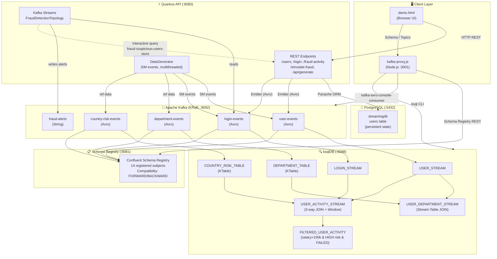

# Architecture Diagram — Real-Time Streaming Platform

## Component Overview



## Port Map

| Service | Port | Protocol |
|---|---|---|
| Kafka Broker | 9092 | PLAINTEXT |
| Schema Registry | 8081 | HTTP |
| ksqlDB Server | 8088 | HTTP |
| Quarkus REST API | 8080 | HTTP |
| PostgreSQL | 5432 | TCP |
| Kafka Proxy | 3001 | HTTP |
| Demo UI Server | 8000 | HTTP |

## Data Flows

### Write Path (User Created)
```
Browser → POST /users → Quarkus API
    → INSERT INTO PostgreSQL (users)
    → Emit UserEvent (Avro) → user-events topic
    → Schema Registry validates against user-events-value schema
```

### Fraud Detection Path
```
login-events topic
    → FraudDetectionTopology (Kafka Streams)
        → filter: LOGIN_STATUS == "FAILED"
        → WINDOW TUMBLING (10 min)
        → GROUP BY user_id
        → count >= 5 → emit to fraud-alerts topic (String)
    → Interactive Query: fraud-suspicious-users-store
    → GET /users/{id}/fraud-activity → returns current window count
```

### ksqlDB Enrichment Path
```
user-events → USER_STREAM
login-events → LOGIN_STREAM
department-events → DEPARTMENT_TABLE (KTable)
country-risk-events → COUNTRY_RISK_TABLE (KTable)

USER_STREAM + DEPARTMENT_TABLE → USER_DEPARTMENT_STREAM (salary, dept info)
LOGIN_STREAM + USER_STREAM + COUNTRY_RISK_TABLE → USER_ACTIVITY_STREAM
USER_ACTIVITY_STREAM → FILTERED_USER_ACTIVITY (salary>100k, HIGH risk, FAILED login)
```

## Technology Stack

| Layer | Technology | Version |
|---|---|---|
| Runtime | Quarkus | 3.x |
| Broker | Apache Kafka (KRaft) | 7.5.3 |
| Schema Registry | Confluent | 7.5.3 |
| Stream Processing | Kafka Streams + ksqlDB | 7.5.3 |
| Serialization | Apache Avro | — |
| Database | PostgreSQL | 15 |
| ORM | Panache (Hibernate Reactive) | — |
| Containerization | Docker Compose | 3.8 |
| UI Proxy | Node.js | — |
