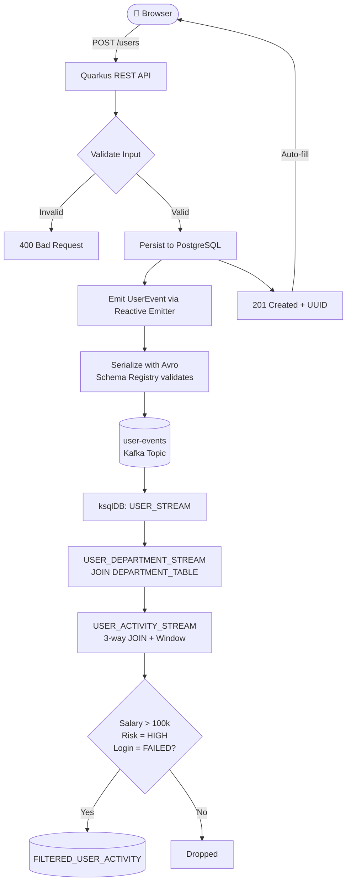
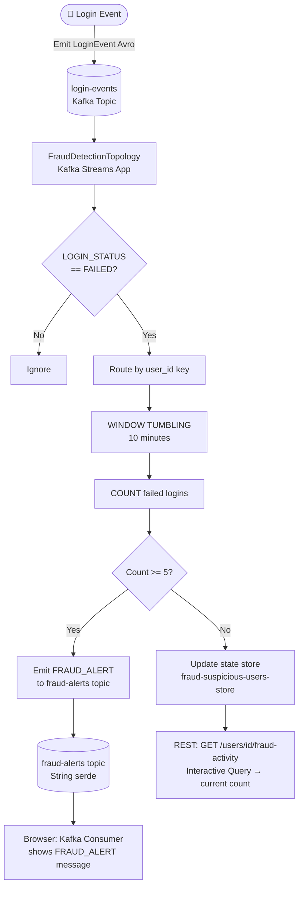
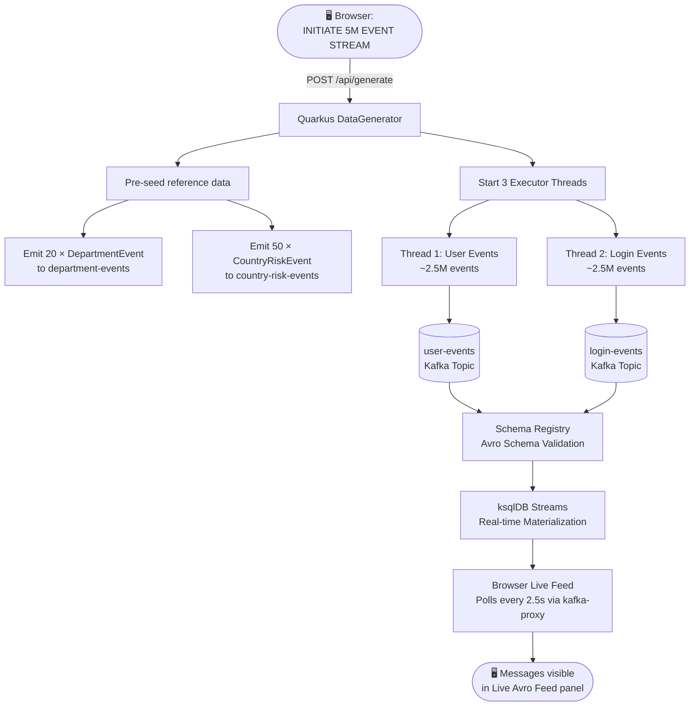
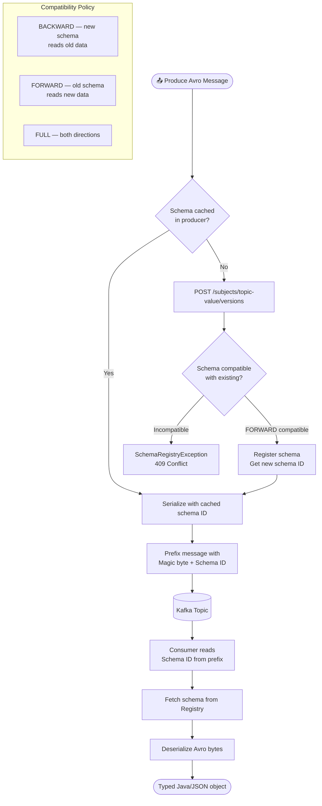
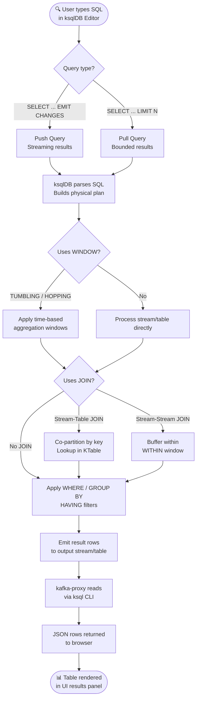

# Flowcharts — Real-Time Streaming Platform

## 1. User Lifecycle Flow

---

## 2. Fraud Detection Flow

---

## 3. 5M Event Generation Flow

---

## 4. Avro Schema Registry Flow

---

## 5. ksqlDB Query Execution Flow

